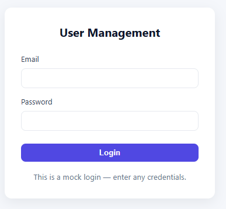
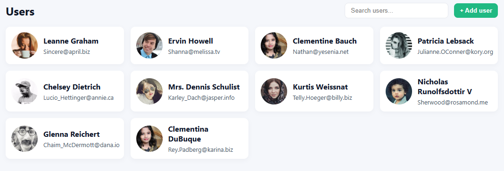
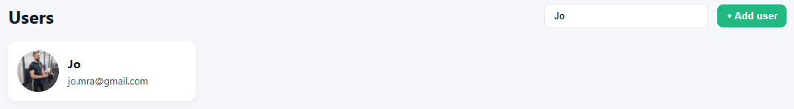

#frontend-task 
**User management app**

***Description***
User management app will have list of users with search and add functionalities.

***Task***
Your task is to build a simple user management app using React and following 
libraries: 
• Use redux for state management  
• Use redux-thunk or redux-saga for async operations 
• Use one of the following libraries for form handling: formik, final-form (react
final-form) or redux-form 
• Use prop-types for each component  
• Use axios or fetch for API communication

***Requirements***
• Login screen should contain simple login form (email + password). Upon 
successful login you should be redirected to user list screen. 
• User list screen should connect to the API, get users list and display it. Users 
list should be in the GRID view. Each view should contain name, username, email and avatar. 
• User list screen should have search bar. Search bar should do automatic 
filtering of the users in the list. This filtering should start after at least 2 
characters are entered in the search bar. 
• User list screen should have an add form. Screen should have “+add user” 
button. Upon clicking on it, add form modal should be shown. It contains 
fields: full name, username, email, avatar URL. 
• Bonus task: add form could have image “upload” functionality - just a dummy 
one, with an option to resize the image. (This image doesn’t need to be 
uploaded anywhere, and user can have some dummy URL for the avatar)

***Additional resources***
• You can use the following API for data: https://jsonplaceholder.typicode.com/
• Use any image for the default avatar URL (used for adding new users): https://i.pravatar.cc

# User Management App - Starter
## Tech choices
- Vite + React + TypeScript
- Redux Toolkit + redux-thunk
- Axios for API requests
- Formik for forms
- PropTypes included (as requested by assignment)
- Plain CSS files per component (for learning clarity, TailWind CSS is now commonly used)

## Notes / Design decisions
- TypeScript chosen to increase code safety. PropTypes are still added to components to match the PDF requirement.
- Redux Toolkit provides concise reducers and includes good defaults. Thunks are used for async fetch (simple and expected by the task).
- Axios for simple HTTP helper; users data is fetched from https://jsonplaceholder.typicode.com/
- Mock login keeps the flow simple; the login stores a client-side token in Redux and protects the /users route.

## How to run
```bash
npm install
npm run dev
# open http://localhost:5173
```

## ScreenShots of User management app






