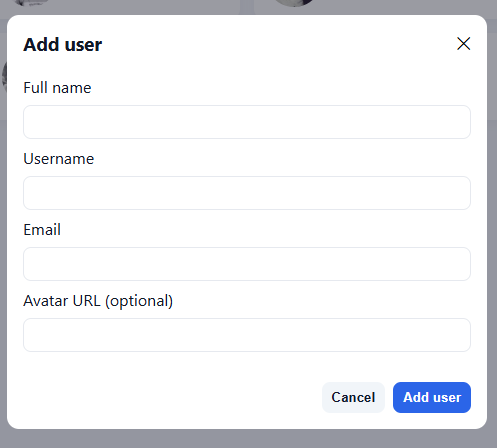

# User Management Frontend

Modern React application with TypeScript, Redux Toolkit, and comprehensive user management features.

## 🚀 Live Demo

**Production**: [https://react-usr-mgmt-app.web.app](https://react-usr-mgmt-app.web.app)

## ⚡ Quick Start

```bash
npm install
npm run dev
# Open http://localhost:5173
```

## 🔑 Demo Credentials

- **Admin**: `admin@demo.com` / `admin123`
- **Manager**: `manager@demo.com` / `manager123`
- **User**: `user@demo.com` / `user123`

## 🛠️ Tech Stack

- **Build Tool**: Vite + React 19 + TypeScript
- **State Management**: Redux Toolkit + Redux Thunk
- **Routing**: React Router v7
- **Forms**: Formik + Yup validation
- **HTTP Client**: Axios
- **Styling**: CSS3 with responsive design
- **Date Picker**: React DatePicker
- **Phone Input**: React Phone Number Input
- **CSV Processing**: PapaParse

## 🎯 Features

### Core Features
- ✅ **Authentication**: JWT-based login/register with role-based access
- ✅ **User Management**: Full CRUD operations with pagination
- ✅ **Real-time Search**: Instant user filtering (2+ characters)
- ✅ **Responsive Design**: Mobile-first approach
- ✅ **Database Mode Toggle**: Switch between real backend and mock data

### Advanced Features
- ✅ **Bulk Operations**: Multi-select, bulk delete, role changes
- ✅ **Data Export/Import**: CSV import/export functionality
- ✅ **Advanced Filtering**: Role, status, date range filters with presets
- ✅ **Communication**: Email users, message history tracking
- ✅ **Analytics Dashboard**: User statistics and insights
- ✅ **User Profiles**: Detailed user information with avatars

## 📁 Project Structure

```
src/
├── api/                    # API layer (axios)
│   ├── authApi.ts          # Authentication endpoints
│   └── usersApi.ts         # User CRUD endpoints
├── components/             # Reusable UI components
│   ├── AddUserModal.tsx    # User creation modal
│   ├── BulkActionsToolbar.tsx # Bulk operations
│   ├── FilterSortPanel.tsx # Advanced filtering
│   ├── ImportPanel.tsx     # CSV import functionality
│   ├── EmailModal.tsx      # Email communication
│   ├── SearchBar.tsx       # Real-time search
│   ├── UserCard.tsx        # User display component
│   └── ...                 # Other components
├── contexts/               # React contexts
│   └── DatabaseModeContext.tsx # Database mode switching
├── forms/                  # Form components
│   └── AddUserForm.tsx     # User creation form
├── hooks/                  # Custom React hooks
│   ├── useAppDispatch.ts   # Typed Redux dispatch
│   └── useAppSelector.ts   # Typed Redux selector
├── pages/                  # Page components
│   ├── AnalyticsPage.tsx   # User analytics dashboard
│   ├── LoginPage.tsx       # Authentication page
│   └── UserListPage.tsx    # Main user management page
├── store/                  # Redux store
│   ├── authSlice.ts        # Authentication state
│   ├── userSlice.ts        # User management state
│   ├── messageSlice.ts     # Message history state
│   ├── selectionSlice.ts   # Bulk selection state
│   └── index.ts            # Store configuration
├── types/                  # TypeScript definitions
│   ├── User.ts             # User type definitions
│   └── Message.ts          # Message type definitions
├── utils/                  # Utility functions
│   ├── csvExport.ts        # CSV export functionality
│   ├── csvImport.ts        # CSV import functionality
│   └── printDirectory.ts   # Print utilities
├── App.tsx                 # Main app component
└── main.tsx                # App entry point
```

## 🔧 Environment Configuration

### Development (.env)
```env
VITE_API_BASE_URL=http://localhost:3001
```

### Production
Environment variables are automatically configured for production deployment.

## 📊 Scripts

- `npm run dev` - Development server with hot reload
- `npm run build` - Build for production
- `npm run preview` - Preview production build
- `npm run lint` - Run ESLint

## 🚀 Deployment

### Firebase Hosting (Current)
- **Auto-deployment**: GitHub Actions on push to `main`
- **Build Command**: `npm run build`
- **Output Directory**: `dist/`
- **Configuration**: `firebase.json`

### Manual Deployment
```bash
npm run build
# Deploy dist/ folder to your hosting provider
```

## 📱 Database Mode Switching

The app supports two data sources:

1. **Real Backend Mode**
   - Uses local/deployed Node.js API
   - Full authentication and CRUD operations
   - Persistent data storage

2. **Mock Database Mode**
   - Uses JSONPlaceholder API
   - Demo purposes only
   - No authentication required

Switch modes on the login page. Your preference is saved in localStorage.

## 📸 Screenshots

### Login Screen


### Users Management


### Add User Modal


### Advanced Filtering


### User Interface


## 🔍 Development

### Adding New Features
1. Create components in `src/components/`
2. Add Redux slices in `src/store/`
3. Define types in `src/types/`
4. Add API calls in `src/api/`
5. Create pages in `src/pages/`

### State Management
- **Redux Toolkit**: Simplified Redux with good defaults
- **Redux Thunk**: Async operations
- **Typed Hooks**: `useAppDispatch` and `useAppSelector`

### Form Handling
- **Formik**: Form state management
- **Yup**: Schema validation
- **TypeScript**: Compile-time type safety

## 🤝 Backend Integration

This frontend is designed to work with the Node.js backend in the `../backend/` directory.

**API Documentation**: See `../txtNotes/backEndPreparationDetails/API_DOCUMENTATION.md`

## 📝 Notes

- **TypeScript**: Provides compile-time type safety and excellent IDE support
- **Redux Toolkit**: Includes good defaults and reduces boilerplate
- **Responsive Design**: Mobile-first approach with CSS Grid and Flexbox
- **Performance**: Optimized with React 19 and Vite's fast build system